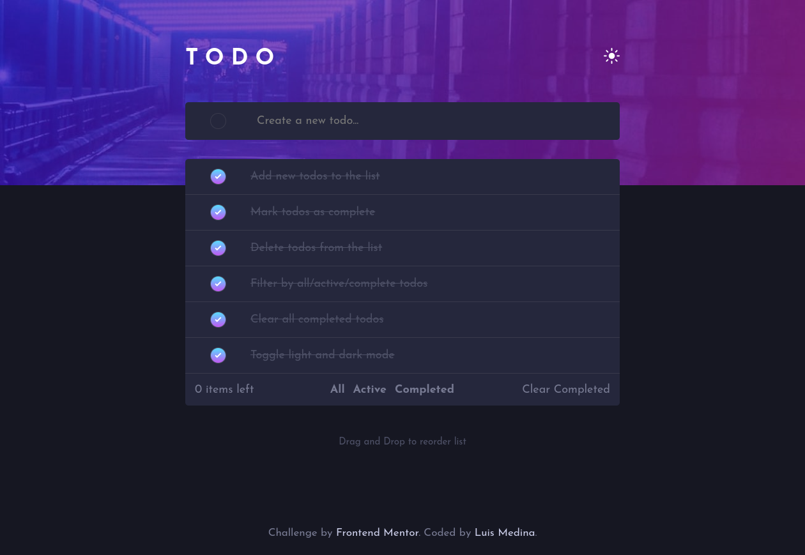
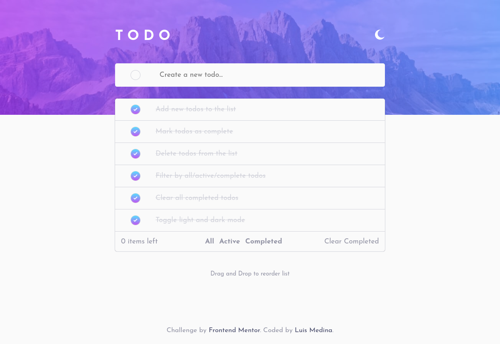

# Frontend Mentor - Todo app solution

This is a solution to the [Todo app challenge on Frontend Mentor](https://www.frontendmentor.io/challenges/todo-app-Su1_KokOW). Frontend Mentor challenges help you improve your coding skills by building realistic projects. 

## Overview

### The challenge

Users should be able to:

- View the optimal layout for the app depending on their device's screen size
- See hover states for all interactive elements on the page
- Add new todos to the list
- Mark todos as complete
- Delete todos from the list
- Filter by all/active/complete todos
- Clear all completed todos
- Toggle light and dark mode
- **Bonus**: Drag and drop to reorder items on the list

### Screenshot

### Links

- Repository URL: [Add solution URL here](https://github.com/lamc305/Todo-App)
- Live Site URL: [Add live site URL here](https://todo-app-lamc305.vercel.app/)

## My process

### Built with

- Semantic HTML5 markup
- CSS custom properties
- Flexbox
- CSS Grid
- Mobile-first workflow
- [React](https://reactjs.org/) - JS library

## Author

- Frontend Mentor - [@lamc305](https://www.frontendmentor.io/profile/lamc305)
- LinkedIn - [Luis Medina](https://www.linkedin.com/in/luis-medina-dev/)

